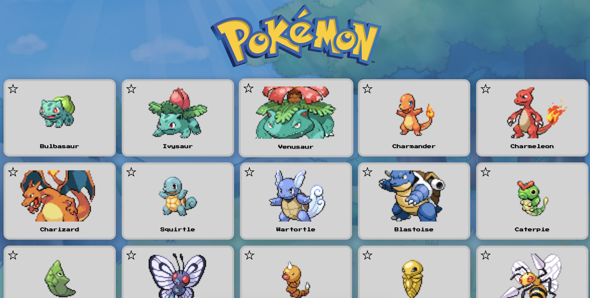

# Pokemon REST API app

This is a simple app that hits the public Pokemon API and displays the pokemons with their data. 

The idea is to be able to request poke-data, add to favourite, and persists state on app refresh.

